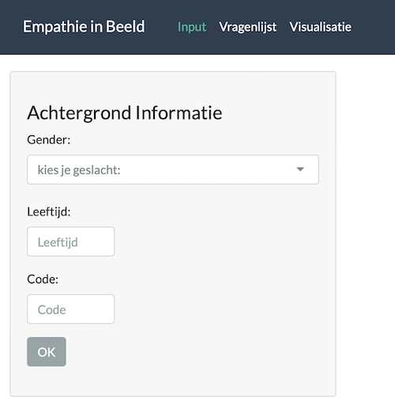

# Dynamiek in beeld

<!-- Include Github badges here (optional) -->
<!-- e.g. Github Actions workflow status -->

Application to be used in a clinical setting to understand empathy. The application allows clinician to conduct a survey and immediately visualize the results. No data is stored in the RShiny server.

## Usage

<!-- We should add here -->
The app runs online at https://utrecht-university.shinyapps.io/empathy-viz/.

The app has three parts:

### Input
Background information of the participant including gender, age and survey code are provided in this section.

### Questionnaire
Questionnaire starts with a basic description of the survey, followed by six question, each with three subquestions.

At the end of the questionnaire, the results of the survey can be downloaded.

### Visualization

Start with selecting the datasource. There is possibility to visualize the current survey or upload existing results saved in .csv format.

Visualization is available in three styles:

## Adapting the survey with new questions

If you would like to modify the app and run locally, please follow the following steps:

### Set up survey
- `data/introduction.csv` - Text in the introduction page, explaining the survey to the participant
- `data/vignettes.csv` - ID of the questions, title, description, and attached figure (to be displayed in the left)
- `data/relationships.csv - Each vignette is described for two more types of relationships, i.e. stranger and foe.
- `data/RadioMatrixFrame.csv` - Scales associated (see image above)
- `data/ending.csv` - Text in the last page
- `data/guideline_vis.csv` - A short explanation of how to use visualization

### Run code
- Clone repository OR download repository (Code --> Download as ZIP)
- Start RStudio and navigate to the folder
- Click on run app

### Built with

- [shiny1.7.1](https://shiny.rstudio.com)

## Contributing

Contributions are what make the open source community an amazing place
to learn, inspire, and create. Any contributions you make are **greatly
appreciated**.

Please refer to the
[CONTRIBUTING](https://github.com/sodascience/osmenrich/blob/main/CONTRIBUTING.md)
file for more information on issues and pull requests.

<!-- Do not forget to also include the license in a separate file(LICENSE[.txt/.md]) and link it properly. -->
### License

The code in this project is released under [MIT license](LICENSE.md).

<!-- CONTACT -->

## Contact

**Dynamiek in Beeld** is project by [Dr. Minet de Wied](https://www.uu.nl/medewerkers/mdewied) (m.dewied@uu.nl).
The technical implementation is provided by the [ODISSEI Social Data
Science (SoDa)](https://odissei-data.nl/nl/soda/) team. The project welcomes feedback,
(scientific) collaboration, and (technical) integration.

Project Link: [https://github.com/sodascience/empathy-viz](https://github.com/sodascience/empathy-viz)
